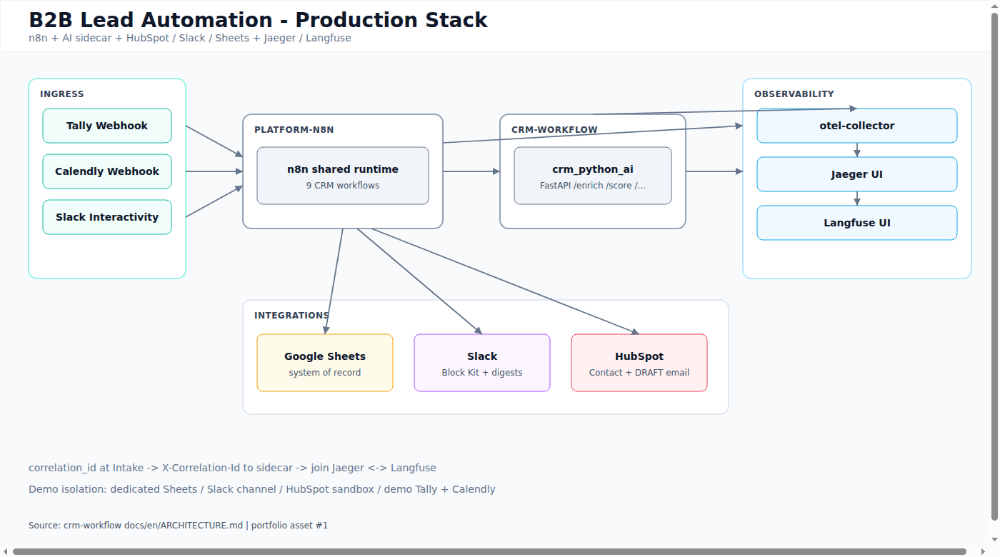
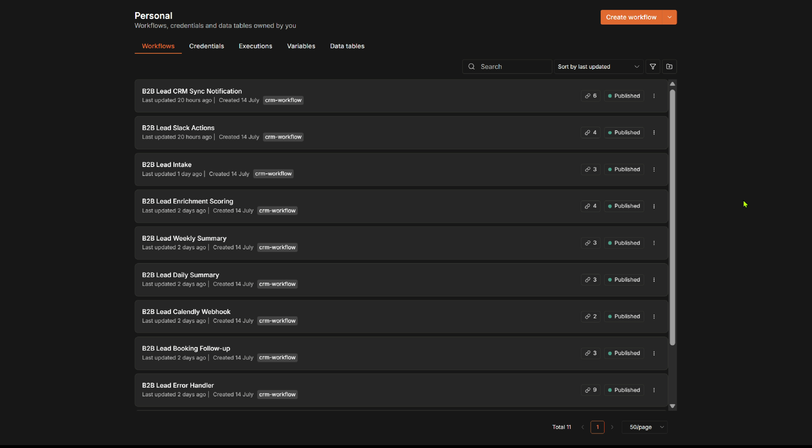
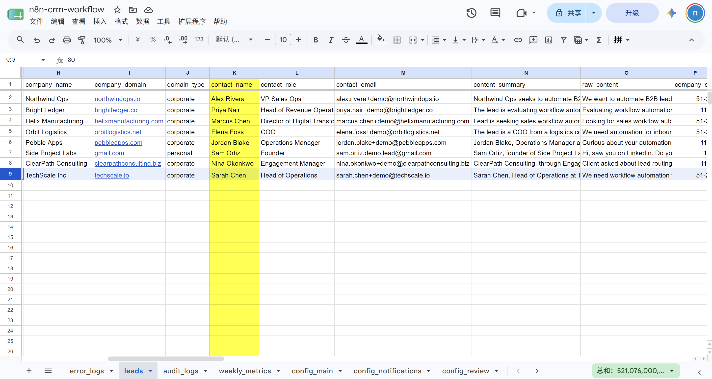
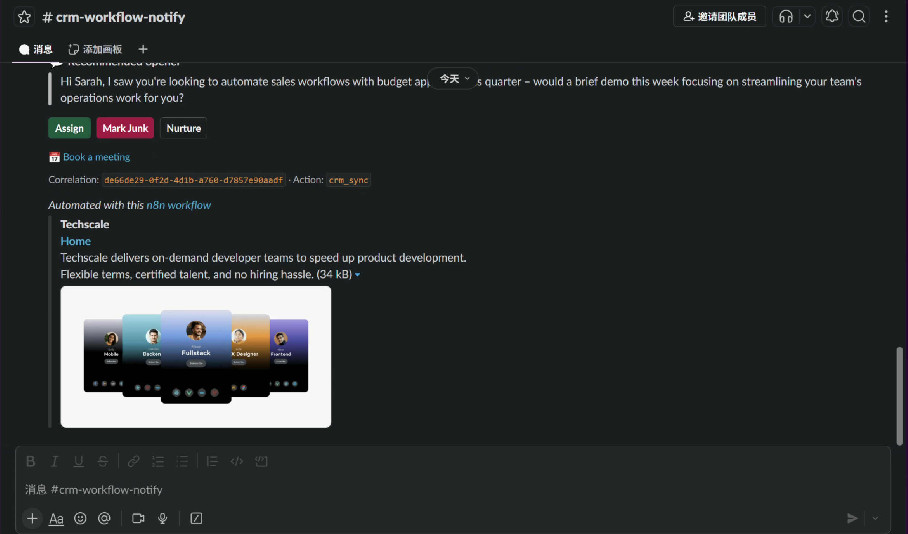
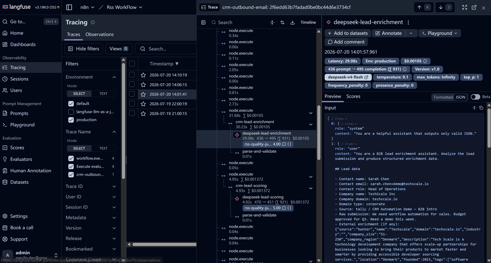
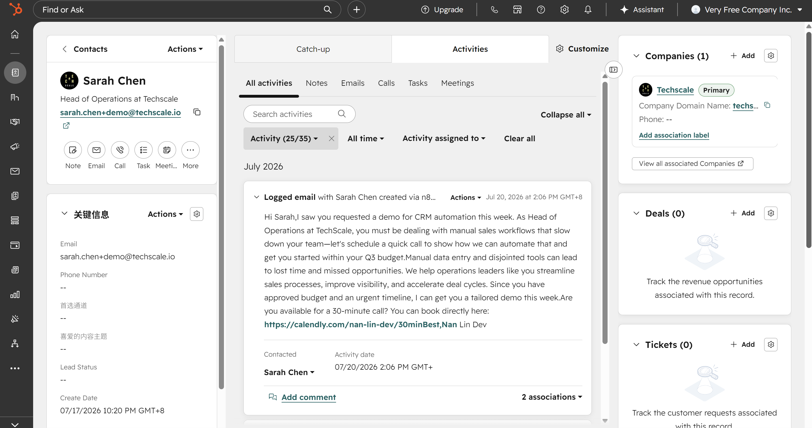
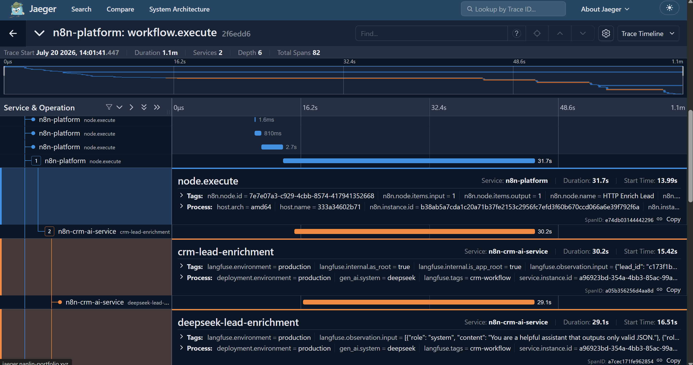

# B2B Lead Automation Template

[](LICENSE)

Inbound B2B leads often stall between form, scoring, CRM, and follow-up. This template runs a **production-gated** path on n8n: Tally intake → DeepSeek enrichment & scoring → Slack human-in-the-loop → HubSpot Contact + email DRAFT → Calendly meeting sync → daily/weekly digests — with Jaeger and Langfuse on every correlated lead.

**Full stack:** n8n + AI sidecar + HubSpot + Slack + Google Sheets + observability.

**Chinese documentation:** [docs/zh/](docs/zh/) · **全链路演示清单（含录像点）：** [docs/zh/DEMO_RUNBOOK.md](docs/zh/DEMO_RUNBOOK.md)

## Showcase

Buyer overview, case narrative, and demo stills:

| Doc | Audience |
|-----|----------|
| **[SHOWCASE](docs/SHOWCASE.md)** | Problem / solution / stack / screenshots / demo video |
| **[CASE_STUDY](docs/CASE_STUDY.md)** | Production-demo narrative and design choices |
| **[DEMO_RUNBOOK](docs/DEMO_RUNBOOK.md)** | Reproduce scenarios A–J on a live stack |



**Demo video:** Loom / `assets/demo-video.mp4` — see [MANIFEST](assets/MANIFEST.md) (narration: [demo-video-script.md](assets/demo-video-script.md)).

**Selected stills** (from remote production demo):

| | | |
|--|--|--|
|  |  |  |
| n8n workflows | Sheets lead row | Slack Block Kit |
|  |  |  |
| Langfuse score | HubSpot Contact + DRAFT | Jaeger correlation |

All filenames and capture status: [assets/MANIFEST.md](assets/MANIFEST.md) · full gallery: [SHOWCASE](docs/SHOWCASE.md).

## Architecture

```text
Tally/Google Forms → Intake → Enrichment & Scoring → CRM Sync & Notification
Calendly / Slack Actions / Daily & Weekly Summary / Booking Follow-up
Error Handler → error_logs (+ Slack alert when gated)
```

Full diagram and component roles: [docs/en/ARCHITECTURE.md](docs/en/ARCHITECTURE.md).  
Workflow catalog: [docs/en/WORKFLOWS.md](docs/en/WORKFLOWS.md).

## Quick start

You need a running **n8n** instance (self-hosted or cloud) that can reach this project's Python sidecar over Docker network (or HTTP). This repo is the **CRM workflows + AI sidecar**; it does not bundle n8n itself.

1. Bring up n8n (any compatible host). If you use the companion `platform-n8n` stack, start it first and ensure Docker networks `proxy_network` + `n8n_platform` exist — see [docs/en/DEPLOY.md](docs/en/DEPLOY.md) and [docs/en/INSTALL.md](docs/en/INSTALL.md).
2. Copy `.env.example` → `.env` and fill secrets ([CREDENTIALS](docs/en/CREDENTIALS.md))
3. Create Sheets from templates — [docs/en/SHEETS_SETUP.md](docs/en/SHEETS_SETUP.md) (**`prompt_registry` must have 6 rows**)
4. `docker compose -f docker/compose.yml up -d --build` (CRM sidecar)
5. Import all 9 workflows from `workflows/` — [docs/en/INSTALL.md](docs/en/INSTALL.md)
6. Re-bind credentials; set Error Workflow → **B2B Lead Error Handler**
7. `config_main.mode=test` → submit a test Tally lead

## Project structure

| Path | Purpose |
|------|---------|
| `workflows/` | n8n JSON exports (import manually) |
| `docker/` | Sidecar compose + env example |
| `python-service/` | FastAPI: `/enrich`, `/score`, `/sales-memo`, `/outbound-email`, `/weekly-insights`, `/manual-review` |
| `prompts/` | Versioned LLM prompts |
| `schemas/` | Lead JSON Schema |
| `sheets/template/` | Spreadsheet CSV templates |
| `scripts/generate_workflows.py` | Regenerate workflow JSON |
| `scripts/sync_workflows_from_export.py` | Sync UI exports → `workflows/` |
| `docs/en/` | English docs (default) |
| `docs/zh/` | Chinese docs |

## Observability

- **Jaeger:** n8n OTEL (`n8n-platform` / `n8n-crm-ai-service`)
- **Langfuse:** LLM generations (`crm-workflow`)
- **correlation_id** at intake + `X-Correlation-Id` to sidecar

Details: [docs/en/OBSERVABILITY.md](docs/en/OBSERVABILITY.md).

## Documentation (English)

| Doc | Topic |
|-----|--------|
| [SHOWCASE](docs/SHOWCASE.md) | Buyer-facing overview & screenshots |
| [CASE_STUDY](docs/CASE_STUDY.md) | Production demo narrative |
| [DEMO_RUNBOOK](docs/DEMO_RUNBOOK.md) | Production scenarios A–J |
| [PORTFOLIO_COPY](docs/PORTFOLIO_COPY.md) | Upwork / Fiverr / LinkedIn drafts |
| [ARCHITECTURE](docs/en/ARCHITECTURE.md) | System design |
| [WORKFLOWS](docs/en/WORKFLOWS.md) | Nine workflows |
| [INSTALL](docs/en/INSTALL.md) | Install & import |
| [DEPLOY](docs/en/DEPLOY.md) | Sidecar deploy |
| [SHEETS_SETUP](docs/en/SHEETS_SETUP.md) | Google Sheets |
| [CONFIG_REFERENCE](docs/en/CONFIG_REFERENCE.md) | Config keys & effects |
| [CREDENTIALS](docs/en/CREDENTIALS.md) | API keys & OAuth |
| [TEST_PRODUCTION](docs/en/TEST_PRODUCTION.md) | test vs production gates |
| [PROMPTS](docs/en/PROMPTS.md) | Prompt files & registry |
| [FIELD_MAPPING](docs/en/FIELD_MAPPING.md) | Form → schema |
| [ERROR_HANDLING](docs/en/ERROR_HANDLING.md) / [NODES](docs/en/ERROR_HANDLING_NODES.md) | Errors |
| [CALENDLY_SETUP](docs/en/CALENDLY_SETUP.md) | Calendly webhooks |
| [SLACK_ACTIONS_SETUP](docs/en/SLACK_ACTIONS_SETUP.md) | Block Kit actions |
| [RUN_EXAMPLE](docs/en/RUN_EXAMPLE.md) | E2E walkthrough |
| [OBSERVABILITY](docs/en/OBSERVABILITY.md) | Tracing |
| [CODE_NODE_MODES](docs/en/CODE_NODE_MODES.md) | Code node modes |
| [WORKFLOW_SYNC_FROM_EXPORT](docs/en/WORKFLOW_SYNC_FROM_EXPORT.md) | UI → repo sync |

## License

MIT — see [LICENSE](LICENSE).

## Regenerate workflows

```bash
python3 scripts/generate_workflows.py
```

Then re-import changed JSON and re-bind credentials + Error Workflow.
