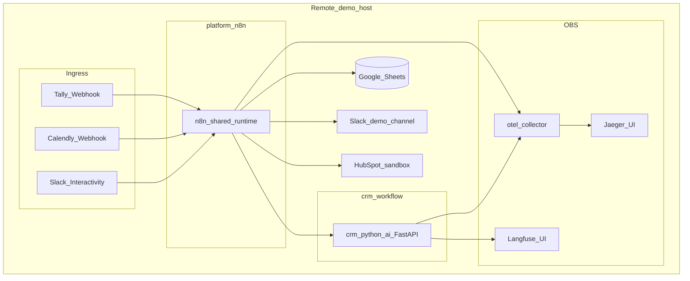

# Case Study — Production B2B Lead Automation

Narrative of a **live demo environment**: remote n8n, CRM AI sidecar, and full observability — not a sandbox mock. Use with [SHOWCASE.md](SHOWCASE.md) (visuals) and [DEMO_RUNBOOK.md](DEMO_RUNBOOK.md) (reproduce steps).

---

## Context

B2B inbound teams typically stitch together a form tool, a spreadsheet, a CRM, Slack, and calendar links. Leads fall through gaps: no consistent score, no review trail, CRM updates without human approval, and no way to answer “what happened to this lead?” across LLM and workflow hops.

This project packages that path as a reusable template:

- **Orchestration:** shared n8n runtime (nine workflows)
- **Intelligence:** Python FastAPI sidecar (DeepSeek) with versioned prompts
- **System of record:** Google Sheets
- **Outbound:** HubSpot Contact + email DRAFT; Slack Block Kit actions
- **Scheduling:** booking reminders; daily / weekly digests
- **Observability:** OpenTelemetry → Jaeger; Langfuse for LLM generations

Demo runs used **`mode=production`** against isolated Sheets / Slack / HubSpot resources so screenshots and traces reflect real side effects — gated the same way a client deploy would be.

---

## Problem

| Pain | Without automation |
|------|-------------------|
| Scoring is ad hoc | Sales guesses priority from free-text form messages |
| CRM pollution | Contacts created before anyone reviews intent |
| Black-box AI | No prompt version or generation history when scores look wrong |
| Blind ops | No daily/weekly KPI rollup; failures silent unless someone notices |
| Fragmented timeline | Form, Slack, HubSpot, and calendar are separate stories |

---

## Solution

### Main path (high-intent lead)

```text
Tally submit
  → Intake (normalize, dedup, correlation_id, write leads)
  → Enrichment & Scoring (domain + /enrich + /score + routing)
  → CRM Sync & Notification
       → HubSpot Contact upsert (when crm_gate passes)
       → Slack high_score Block Kit (Assign / Junk / Nurture)
       → Optional first-touch outbound draft → draft_pending_review
```

### Human-in-the-loop

Sales acts in Slack. **Assign** re-enters CRM Sync: upsert Contact, then log the AI outbound email on the HubSpot timeline as **DRAFT** — human-approved, not auto-sent. Sheets remain SoT for score, review status, and draft fields.

### Meeting and ops loops

- **Calendly** webhook matches invitee email → meeting fields on the same lead row.
- **Booking Follow-up** reminds when a high-score lead stays `not_booked` past the configured hours.
- **Daily / Weekly Summary** aggregate KPIs; Slack only when `mode=production` **and** the matching `config_notifications.*.enabled` flag is true. Weekly always appends `weekly_metrics` (including when Slack is skipped in test).

### Observability as a product feature

Every lead gets a `correlation_id` at intake. Sidecar calls send `X-Correlation-Id`. Operators join:

- **Jaeger** — n8n + sidecar spans (`n8n-platform`, `n8n-crm-ai-service`)
- **Langfuse** — enrich / score / weekly-insights generations (`crm-workflow`, prompt version visible)

That story is what portfolio stills of Langfuse and Jaeger are meant to prove.

---

## Architecture (demo target)



Component detail: [ARCHITECTURE](en/ARCHITECTURE.md).

---

## What we demonstrated (production mode)

Aligned with [DEMO_RUNBOOK](DEMO_RUNBOOK.md) portfolio bar: **A + B + E + J** required; at least two of C / D / G / H; Langfuse + Jaeger stills.

| Scenario | Outcome |
|----------|---------|
| **A — High-score lead** | Sheets row with score + statuses; Slack Block Kit; Langfuse `/score` (or enrich); Jaeger span tree with `correlation_id` |
| **B — Slack Assign** | HubSpot Contact; timeline **DRAFT** email; Sheets `crm_contact_id` / review fields |
| **E — Calendly** | Meeting fields updated (real booking or signed mock webhook) |
| **G / H** | Booking reminder and/or Daily–Weekly Slack digests under notification gates |
| **J — Panorama** | Nine workflows listed; Enrichment canvas visible |

**HubSpot scope (intentional):** Contact upsert + post-Assign DRAFT email. Sheets stay SoT for scoring and routing. No deep custom-property program — visual proof of sync + human-approved draft is enough for the portfolio narrative.

---

## Design choices that matter to buyers

### 1. Test → production gates

Outbound Slack and HubSpot are skipped in `mode=test`. Digests use the same pattern (`Should Send *` → Skip Slack vs Slack node). Clients can wire credentials and prompts in test, then flip one cell in `config_main`.

### 2. Sheets as SoT, CRM as projection

Score, recommended action, review status, and draft copy live in Sheets. HubSpot receives contact identity and a DRAFT engagement when a human Assigns — reducing accidental spam and CRM noise.

### 3. Notification matrix

`config_notifications` toggles `high_score_lead`, `review_required`, `first_touch_email`, `booking_reminder`, `daily_summary`, `weekly_summary`, `error_alert` independently. Demo isolation uses a dedicated channel and spreadsheet.

### 4. AI is inspectable

Prompts live under `prompts/` and `prompt_registry` in Sheets. Langfuse shows generation + version — useful in sales conversations when someone asks “why did this score 82?”

### 5. Error path is first-class

Main workflows point Error Workflow at **B2B Lead Error Handler** → `error_logs` (+ optional Slack `error_alert` when gated). Failures are auditable, not silent.

---

## Results (demo narrative)

For portfolio and client conversations, frame outcomes as **capabilities proven in production mode**, not fabricated ROI percentages:

- End-to-end lead handled in one correlated path (form → score → Slack → HubSpot DRAFT → meeting fields).
- Sales control retained via Slack actions; email never auto-sent from the demo path.
- Ops visibility: digests and weekly metrics rows; traces in Jaeger; LLM generations in Langfuse.
- Safe rollout story: same workflows, `test` then `production`, isolated demo resources.

Visual proof: [SHOWCASE.md](SHOWCASE.md) · capture status: [assets/MANIFEST.md](../assets/MANIFEST.md).

---

## How to reproduce

1. Deploy platform n8n + CRM sidecar + OBS stacks ([DEPLOY](en/DEPLOY.md), platform `DEPLOY.md`).
2. Import nine workflows; rebind credentials; set Error Workflow ([INSTALL](en/INSTALL.md)).
3. Start with `config_main.mode=test`; run [RUN_EXAMPLE](en/RUN_EXAMPLE.md) or DEMO_RUNBOOK **H0**.
4. Switch to isolated demo Sheets / Slack / HubSpot; set `mode=production` and enable notification rows.
5. Execute DEMO_RUNBOOK scenarios **A → B → E → J** (plus digests / booking as needed).

Chinese operator checklist: [zh/DEMO_RUNBOOK.md](zh/DEMO_RUNBOOK.md).

---

## Positioning lines (short)

| Angle | Line |
|-------|------|
| Credibility | Production-mode full chain — not a mock UI |
| Safety | Demo isolation; same gates for client `test` → `production` |
| Observability | Every lead has `correlation_id`; Jaeger + Langfuse join the path |
| HubSpot | Contact sync + human-approved email DRAFT |

Longer platform copy: use your Upwork / Fiverr / LinkedIn drafts locally; keep them out of this public repo.
