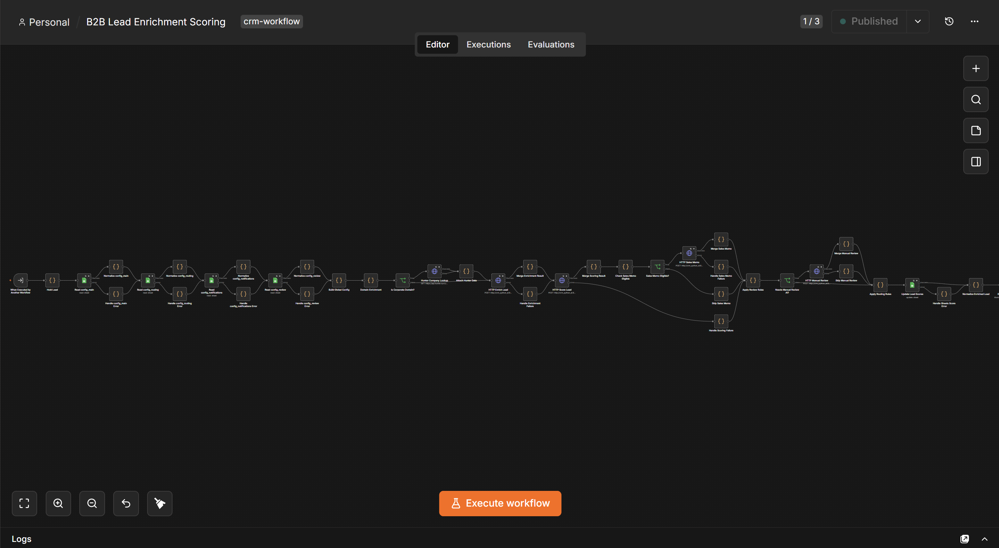
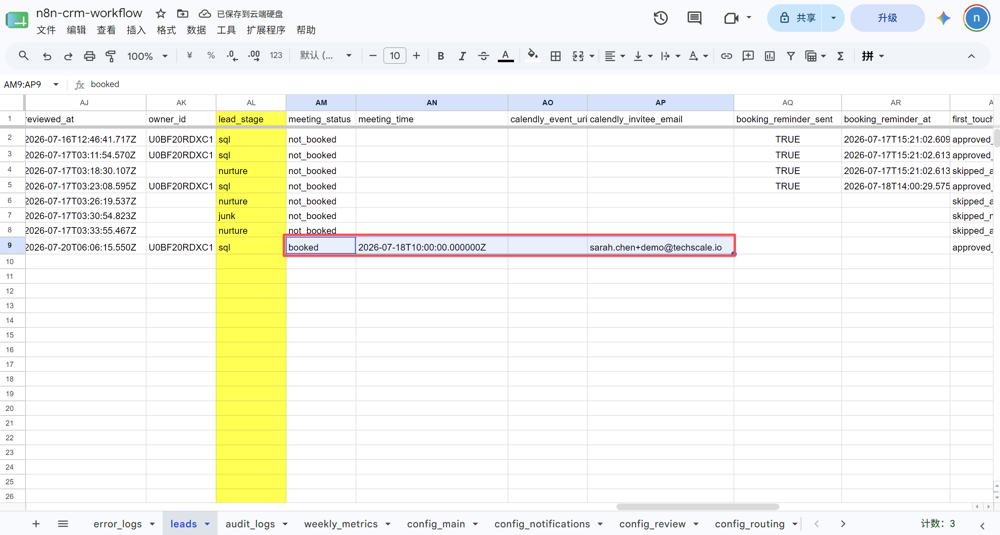
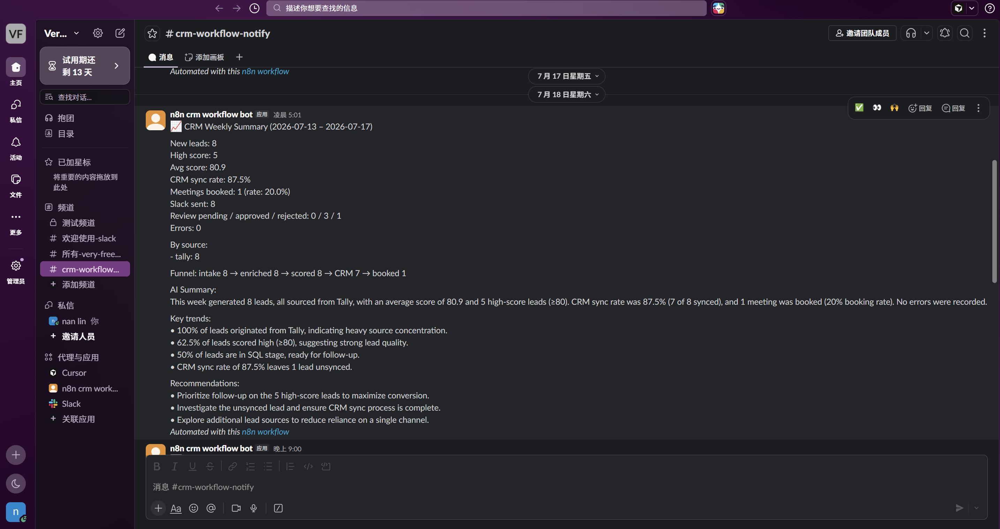
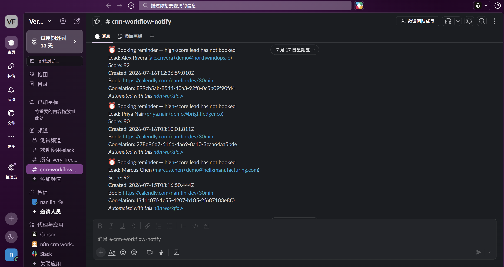

# Showcase — B2B Lead Automation

Buyer-facing overview of a **production-mode** lead pipeline: form → AI score → Slack human-in-the-loop → HubSpot DRAFT → Calendly → daily/weekly digests, with Jaeger + Langfuse on every path.

**Live demo environment** (remote n8n + sidecar + observability). Not a mocked slideshow.

| | |
|--|--|
| **Case study** | [CASE_STUDY.md](CASE_STUDY.md) |
| **Run the demo yourself** | [DEMO_RUNBOOK.md](DEMO_RUNBOOK.md) |
| **Assets** | [assets/](../assets/) · [MANIFEST](../assets/MANIFEST.md) |

---

## Value proposition

Inbound B2B leads stall between form submit, scoring, CRM, and sales follow-up. This template closes that gap with gated automation: Sheets as system of record, DeepSeek enrichment/scoring, Slack Assign / Junk / Nurture, HubSpot contact + human-approved email DRAFT, Calendly meeting sync, and scheduled digests — all correlatable via `correlation_id` in Jaeger and Langfuse.

**Full stack:** n8n + Python AI sidecar + HubSpot + Slack + Google Sheets + OpenTelemetry / Jaeger / Langfuse.

---

## Demo video

2–3 minute English walkthrough (problem → Tally → Slack + Langfuse → Assign / HubSpot DRAFT → Calendly → Jaeger CTA).

| Asset | Location |
|-------|----------|
| Narration script | [assets/demo-video-script.md](../assets/demo-video-script.md) |
| Recording | `assets/demo-video.mp4` **or** Loom URL in [MANIFEST](../assets/MANIFEST.md) |

Paste the public Loom / video URL here when published:

```text
(demo video URL)
```

---

## Architecture


Ingress (Tally, Calendly, Slack) → shared n8n → CRM FastAPI sidecar → Sheets / HubSpot / Slack; traces to OTEL → Jaeger; LLM generations to Langfuse.

Deep dive: [ARCHITECTURE](en/ARCHITECTURE.md) · nine workflows: [WORKFLOWS](en/WORKFLOWS.md).

---

## Selected screenshots

Stills from the remote production demo (demo identities only). Filenames match [assets/MANIFEST.md](../assets/MANIFEST.md).

### Workflow panorama

| | |
|--|--|
| Nine n8n workflows |  |
| Enrichment & Scoring canvas |  |

### High-score path (Scenario A)

| | |
|--|--|
| Sheets lead row after Tally |  |
| Slack Block Kit high-score card |  |
| Langfuse scoring generation |  |
| Jaeger trace + correlation |  |

### Assign → HubSpot (Scenario B)

| | |
|--|--|
| HubSpot Contact + DRAFT email on timeline |  |

One still (`07`) shows both the Contact and the logged outbound **DRAFT** email after Slack Assign — no separate `08` file.

### Meeting + digests + booking

| | |
|--|--|
| Calendly → Sheets meeting fields |  |
| Daily / Weekly Slack digest |  |
| Booking reminder Slack |  |

---

## What buyers get

| Capability | What it proves |
|------------|----------------|
| **Production gates** | Slack / HubSpot only when `mode=production` and notification flags allow — safe `test` → `production` rollout |
| **Human-in-the-loop** | Slack Assign / Junk / Nurture; outbound email logged as HubSpot **DRAFT**, not auto-sent |
| **AI with provenance** | Versioned prompts; Langfuse generations tagged `crm-workflow` |
| **End-to-end tracing** | `correlation_id` from intake through sidecar; Jaeger services `n8n-platform` / `n8n-crm-ai-service` |
| **Ops digests** | Daily / Weekly summaries gated like other notifications; Weekly appends `weekly_metrics` even when Slack is skipped |

---

## Stack at a glance

| Layer | Tech |
|-------|------|
| Orchestration | n8n (9 workflows) |
| AI sidecar | FastAPI — `/enrich`, `/score`, `/sales-memo`, `/outbound-email`, `/weekly-insights`, `/manual-review` |
| SoT | Google Sheets |
| CRM / collab | HubSpot, Slack Block Kit |
| Scheduling | Booking follow-up, Daily / Weekly Summary |
| Observability | OpenTelemetry → Jaeger; Langfuse |

---

## Next steps

1. Skim [CASE_STUDY.md](CASE_STUDY.md) for the narrative and design choices.
2. Reproduce locally or on a remote host with [INSTALL](en/INSTALL.md) + [DEMO_RUNBOOK.md](DEMO_RUNBOOK.md) (`mode=test` first).
3. Flip `config_main.mode=production` only on an isolated demo spreadsheet / Slack channel / HubSpot sandbox.
4. Platform copy drafts: [PORTFOLIO_COPY.md](PORTFOLIO_COPY.md).
