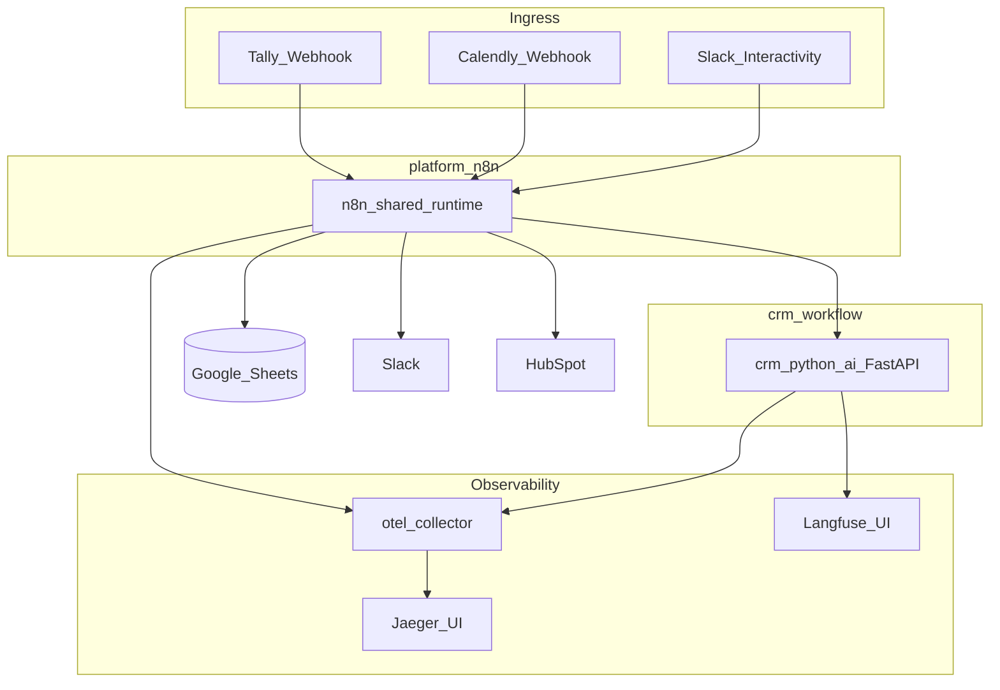

# Architecture

High-level design of the B2B lead automation stack: shared n8n runtime, CRM Python AI sidecar, Google Sheets as system of record, HubSpot/Slack outbound, and full observability.

## System diagram



## Components

| Component | Role |
|-----------|------|
| **platform-n8n** | Shared n8n + Postgres; hosts all CRM workflows |
| **crm_python_ai** | FastAPI sidecar: `/enrich`, `/score`, `/sales-memo`, `/outbound-email`, `/weekly-insights`, `/manual-review` |
| **Google Sheets** | Business SoT: leads, config tabs, audit/error logs, weekly metrics, prompt registry |
| **HubSpot** | Contact upsert + human-approved email DRAFT on Assign (not scoring SoT) |
| **Slack** | Notifications + Block Kit Assign / Junk / Nurture |
| **otel-collector → Jaeger** | Distributed traces (`n8n-platform`, `n8n-crm-ai-service`) |
| **Langfuse** | LLM generations tagged `crm-workflow` |

## Networks

| Network | Who joins | Purpose |
|---------|-----------|---------|
| `n8n_platform` | n8n, `crm_python_ai` | Sidecar calls at `http://crm_python_ai:8001/...` |
| `proxy_network` | n8n, sidecar, OTEL, Langfuse, Jaeger | Observability endpoints |

## Main pipeline

```text
Tally/Google Forms
  → Intake (normalize, dedup, write leads)
  → Enrichment & Scoring (domain + LLM + routing)
  → CRM Sync & Notification (HubSpot gate + Slack + optional first-touch draft)
```

Parallel paths:

- **Calendly** → meeting status on matched lead
- **Slack Actions** → sheet updates + optional post-assign HubSpot DRAFT
- **Daily / Weekly Summary** → digests (Slack gated); Weekly appends `weekly_metrics`
- **Booking Follow-up** → reminder for high-score leads not booked
- **Error Handler** → `error_logs` + optional Slack `error_alert`

## Correlation and tracing

1. **Intake** generates `correlation_id` early and writes it to Sheets.
2. Downstream HTTP calls to the sidecar send header `X-Correlation-Id`.
3. n8n OTEL spans and Langfuse generations carry the same business id / W3C `trace_id` for joining Jaeger ↔ Langfuse.

See [OBSERVABILITY.md](OBSERVABILITY.md) and [WORKFLOWS.md](WORKFLOWS.md).
