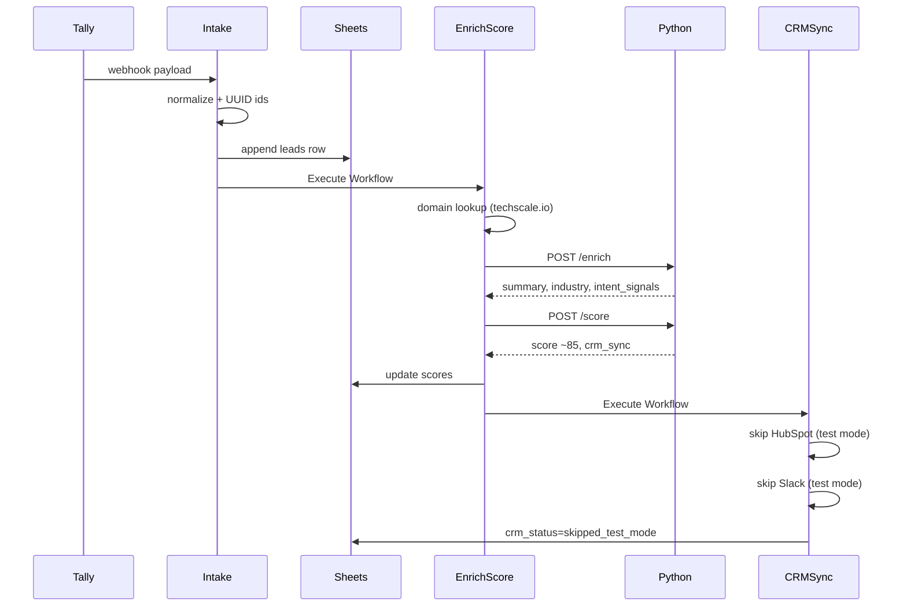

# Run Example

End-to-end test walkthrough with `mode=test`.

## Sample Tally submission

Submit this via your Tally form or curl the webhook directly:

```bash
curl -X POST https://your-n8n-domain/webhook/tally-lead \
  -H "Content-Type: application/json" \
  -d '{
    "eventType": "FORM_RESPONSE",
    "data": {
      "formName": "B2B Contact",
      "formUrl": "https://tally.so/r/demo123",
      "fields": [
        {"label": "Name", "value": "Sarah Chen"},
        {"label": "Email", "value": "sarah.chen@techscale.io"},
        {"label": "Role", "value": "Head of Operations"},
        {"label": "Company", "value": "TechScale Inc"},
        {"label": "Message", "value": "We are looking for workflow automation for our sales team. Budget approved for Q3. Need demo this week."}
      ]
    }
  }'
```

## Expected pipeline



## Expected leads row (after completion)

| Field | Example value |
|-------|---------------|
| lead_id | (uuid) |
| correlation_id | (uuid) |
| contact_email | sarah.chen@techscale.io |
| company_domain | techscale.io |
| domain_type | corporate |
| score | 75-90 (LLM dependent) |
| recommended_action | crm_sync |
| enrichment_status | complete |
| crm_status | skipped_test_mode |
| notification_status | skipped_test_mode |
| processing_status | completed |

## Verify observability

### Langfuse

Search by `correlation_id` from the leads row. Expect:

- Span: `crm-lead-enrichment`
- Span: `crm-lead-scoring`
- Metadata: `lead_id`, `score`, `prompt_version`, `prompt_hash`

### Jaeger

Search by trace_id (from n8n execution or Python logs). Expect:

- Service: `n8n-crm-workflow` (intake + HTTP nodes)
- Service: `n8n-crm-ai-service` (Python HTTP spans)

## Duplicate submission test

Submit the same email again. Expect:

- Same `lead_id` preserved
- New `correlation_id` generated
- `is_update=true` in audit_logs
- Row updated, not duplicated

## Production smoke test

1. Set `config_main.mode=production`
2. Submit one lead
3. Verify HubSpot contact created
4. Verify Slack notification received
5. Set back to `test`


## Checklist extras

- Confirm Google Sheets `prompt_registry` has **6 rows** (including `sales_memo`, `outbound_email`, `weekly_insights`). See [PROMPTS.md](PROMPTS.md).
- Confirm sidecar `GET /prompts` lists the same six keys.
- Observability checks: [OBSERVABILITY.md](OBSERVABILITY.md).
