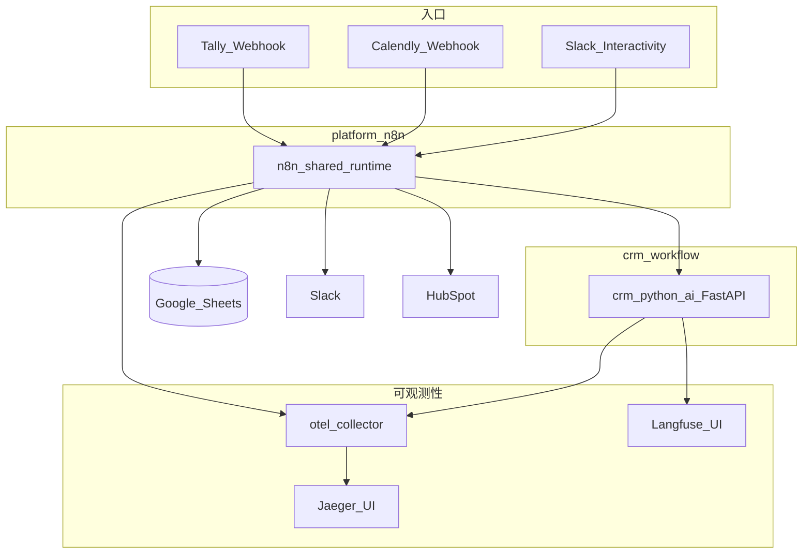

# 架构

B2B 线索自动化栈的高层设计：共享 n8n 运行时、CRM Python AI sidecar、以 Google Sheets 为事实来源（SoT）、HubSpot/Slack 出站，以及完整可观测性。

## 系统图



## 组件

| 组件 | 职责 |
|------|------|
| **platform-n8n** | 共享 n8n + Postgres；托管全部 CRM 工作流 |
| **crm_python_ai** | FastAPI sidecar：`/enrich`、`/score`、`/sales-memo`、`/outbound-email`、`/weekly-insights`、`/manual-review` |
| **Google Sheets** | 业务 SoT：线索、配置页、审计/错误日志、周报指标、prompt 注册表 |
| **HubSpot** | Contact upsert + Assign 后人审批准的邮件 DRAFT（非评分 SoT） |
| **Slack** | 通知 + Block Kit Assign / Junk / Nurture |
| **otel-collector → Jaeger** | 分布式追踪（`n8n-platform`、`n8n-crm-ai-service`） |
| **Langfuse** | LLM generation，标签 `crm-workflow` |

## 网络

| 网络 | 加入方 | 用途 |
|------|--------|------|
| `n8n_platform` | n8n、`crm_python_ai` | Sidecar 调用：`http://crm_python_ai:8001/...` |
| `proxy_network` | n8n、sidecar、OTEL、Langfuse、Jaeger | 可观测性端点 |

## 主链路

```text
Tally/Google Forms
  → Intake（归一化、去重、写入 leads）
  → Enrichment & Scoring（域名 + LLM + 路由）
  → CRM Sync & Notification（HubSpot 门控 + Slack + 可选首触草稿）
```

并行路径：

- **Calendly** → 更新已匹配线索的会议状态
- **Slack Actions** → 更新表格 + Assign 后可选 HubSpot DRAFT
- **Daily / Weekly Summary** → 摘要（Slack 门控）；Weekly 始终追加 `weekly_metrics`
- **Booking Follow-up** → 高分未预约线索提醒
- **Error Handler** → `error_logs` + 可选 Slack `error_alert`

## 关联与追踪

1. **Intake** 尽早生成 `correlation_id` 并写入 Sheets。
2. 下游对 sidecar 的 HTTP 调用携带请求头 `X-Correlation-Id`。
3. n8n OTEL span 与 Langfuse generation 携带同一业务 id / W3C `trace_id`，便于在 Jaeger ↔ Langfuse 间关联。

参见 [OBSERVABILITY.md](OBSERVABILITY.md) 与 [WORKFLOWS.md](WORKFLOWS.md)。
