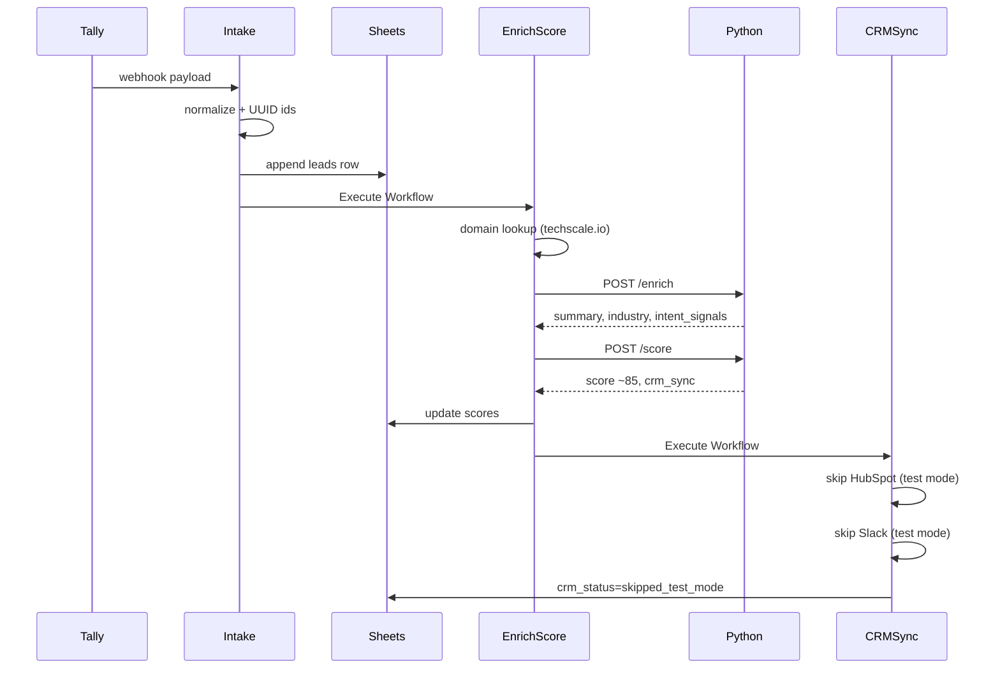

# 运行示例

在 `mode=test` 下的端到端测试演练。

## 示例 Tally 提交

通过 Tally 表单提交，或直接 curl webhook：

```bash
curl -X POST https://your-n8n-domain/webhook/tally-lead \
  -H "Content-Type: application/json" \
  -d '{
    "eventType": "FORM_RESPONSE",
    "data": {
      "formName": "B2B Contact",
      "formUrl": "https://tally.so/r/demo123",
      "fields": [
        {"label": "Name", "value": "Sarah Chen"},
        {"label": "Email", "value": "sarah.chen@techscale.io"},
        {"label": "Role", "value": "Head of Operations"},
        {"label": "Company", "value": "TechScale Inc"},
        {"label": "Message", "value": "We are looking for workflow automation for our sales team. Budget approved for Q3. Need demo this week."}
      ]
    }
  }'
```

## 预期流水线



## 预期 leads 行（完成后）

| 字段 | 示例值 |
|------|--------|
| lead_id | (uuid) |
| correlation_id | (uuid) |
| contact_email | sarah.chen@techscale.io |
| company_domain | techscale.io |
| domain_type | corporate |
| score | 75-90（取决于 LLM） |
| recommended_action | crm_sync |
| enrichment_status | complete |
| crm_status | skipped_test_mode |
| notification_status | skipped_test_mode |
| processing_status | completed |

## 验证可观测性

### Langfuse

用 leads 行中的 `correlation_id` 搜索。预期：

- Span：`crm-lead-enrichment`
- Span：`crm-lead-scoring`
- Metadata：`lead_id`、`score`、`prompt_version`、`prompt_hash`

### Jaeger

按 trace_id 搜索（来自 n8n 执行或 Python 日志）。预期：

- Service：`n8n-crm-workflow`（intake + HTTP 节点）
- Service：`n8n-crm-ai-service`（Python HTTP span）

## 重复提交测试

用同一邮箱再次提交。预期：

- 保留同一 `lead_id`
- 生成新的 `correlation_id`
- audit_logs 中 `is_update=true`
- 行被更新，不会重复插入

## 生产冒烟测试

1. 设置 `config_main.mode=production`
2. 提交一条线索
3. 确认 HubSpot contact 已创建
4. 确认收到 Slack 通知
5. 改回 `test`


## 额外检查清单

- 确认 Google Sheets `prompt_registry` 有 **6 行**（含 `sales_memo`、`outbound_email`、`weekly_insights`）。见 [PROMPTS.md](PROMPTS.md)。
- 确认 sidecar `GET /prompts` 列出相同六个 key。
- 可观测性检查：[OBSERVABILITY.md](OBSERVABILITY.md)。
